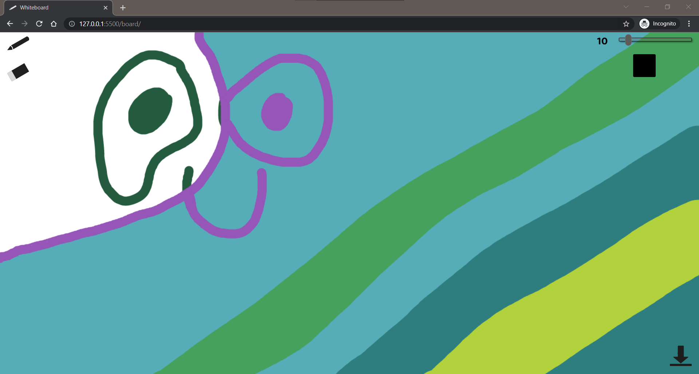

# Local whiteboard

This is rewritten (from JS to TypeScript) frontend of [whiteboard-v6](https://github.com/Pawel-608/whiteboard-v6). You can run it locally just download code and open /board/index.html

## Used technologies

- JS
- TS

## Short description

Draw, erase and download images!
